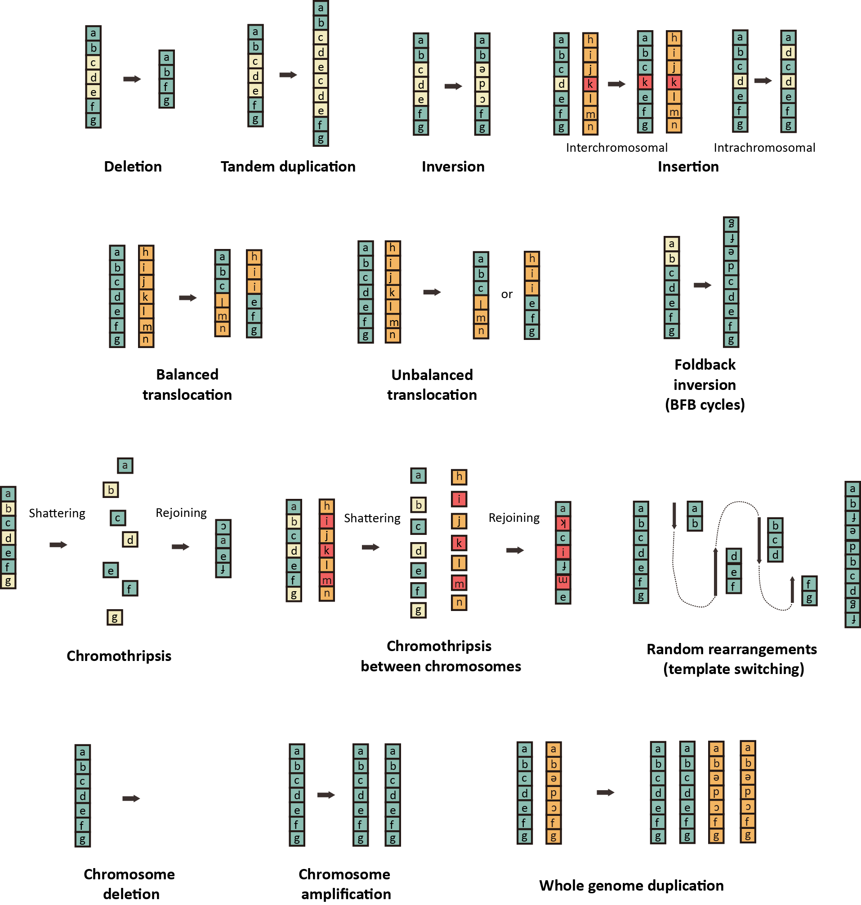

# Overview

- InfoGenomeR_simulation generates approximately 3000 germline SVs based on the phase 3 of the 1000 Genomes Project (by randomly selecting 1500 germline SVs from the reported SVs in phase 3 individuals
and randomly generating 1500 germline SVs) and approximately 200 somatic SVs based on 140 TCGA cancer genomes (by using 13 simple and complex operations).
- For each cancer genome, cancer purity is simulated at 60%, 75%, and 90%, and haplotype coverage is simulated at 3X, 5X, 10X, 15X, and 20X.
- Available for GRCh37 and GRCh38.

    
  </a>

# Requirements

- BWA-MEM
- ART
# Usage

- Selection of a 1000G individual and SV simulations.\
`./simulation/simulation_iteration_3_to_20_pre_simulation.sh`
- It generates 32 simulated genomes from simul1 to simul32. Select one of them, and move to the directory.\
`cd simul1`\
`./simulation_iteration_3_to_20_pre_simulation_selection.sh`
- In the folder, related files are generated as follows.
  - germline_SVs.results.*: a simulated germline genome (tab-seperated format; coordinate1, coordinate2, cumulative length, haplotype, and chromosome).
  - SVs.results.*: a simulated cancer genome (tab-seperated format; coordinate1, coordinate2, cumulative length, haplotype, and chromosome).
  - germ_simulated.fa: a simulated germline genome  in the fasta format, which is used for ART simulation.
  - simulated.fa: a simulated cancer genome in the fasta format, which is used for ART simulation.
  - true_SV_sets_dup_checked.refcoor.germline_initial_SVs_changed_size1000.int: a true germline SV set of DEL, DUP, and INV (>1kb and except ALU, LINE, and SVA insertion).
  - true_SV_sets_somatic_dup_checked.refcoor: a true somatic SV set.
  - germline_results.cnv.edited: a true germline CNV set.
  - somatic_results.cnv: a true somatic CNV set.
- Excecute the ART simulation (3X, 5X, 10X, 15X, and 20X haplotype coverage and 0.6, 0.75, and 0.9 cancer purity), and perform BWA-MEM mapping.\
`./simulation_iteration_art_3_to_20.sh`
- Releated folders and files are generated.
  - germ_simulated_sorted.bam: a simulated germline BAM (in the f3, f5, f10, f15, and f20 folders).
  - simulated_sorted.bam: a simulated somatic BAM (in p0.6, p0.75, and p0.9 in the f* folders).
# Simulated data
- NA12878-based simulated data for GRCh37 and GRCh38 are deposited in Zenodo.
  - copy_numbers.control: copy number segmentation profiles from the simulated germline genome by InfoGenomeR.
  - cp_norm: genome-binning read depths from the simulated cancer genome.
  - cp_norm_germ: genome-binning read depths from the simulated cancer genome.
  - coverage.txt: genome-binning read depths for JaBbA analysis.
  - delly.format: somatic SVs detected by DELLY2.
  - manta.format: somatic SVs detected by Manta.
  - novobreak.format: somatic SVs detected by novoBreak.
  - het_snps.format: heterozygous SNPs.
  - hom_snps.format: homozygous SNPs.
  - NPE.fq1 and NPE.fq2: non-propoerly paired reads.
  - simulated_genome: related files and folders generated by the simulation code. To generate the fasta files and BAM files (not required for InfoGenomeR inputs but optional), execute following scripts.\
  `perl /home/qlalf1457/InfoGenomeR_simulation/simulation/results_to_fa.pl`\
  `perl /home/qlalf1457/InfoGenomeR_simulation/simulation/germ_results_to_fa.pl`\
  `./simulation_iteration_art_3_to_20.sh`
   - InfoGenomeR_output: output files from InfoGenomeR.
